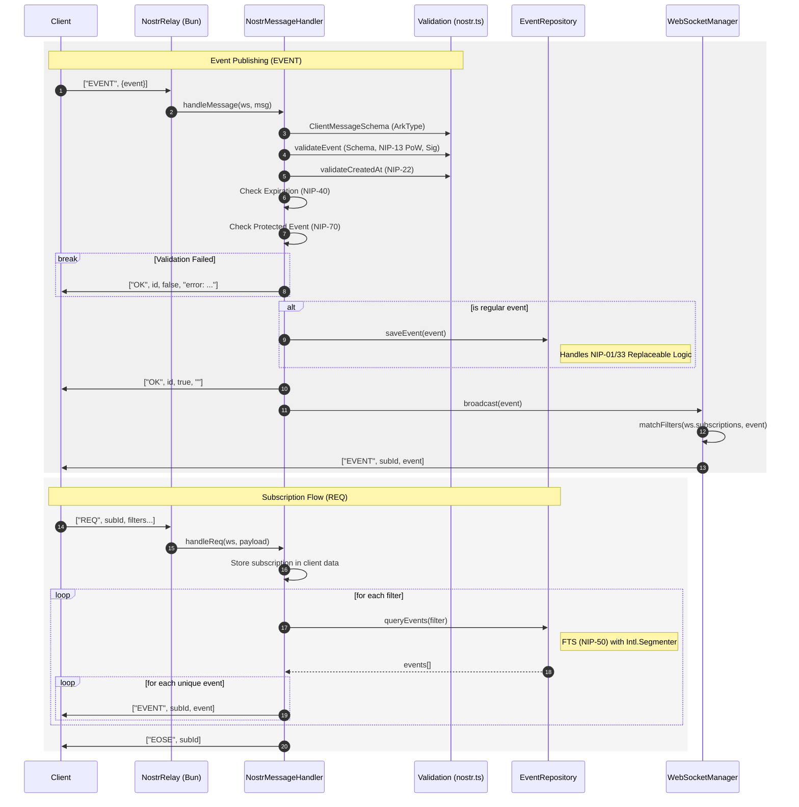

<div align="center">
  <h1>n0str</h1>
  <p><strong>The Single Binary, Zero Friction, Multi-Language Nostr Relay</strong></p>

  <p>
    <a href="https://github.com/tani/n0str/releases/tag/nightly"></a>
    <a href="LICENSE"></a>
    <a href="https://bun.sh/"></a>
    
    <a href="https://github.com/tani/n0str/actions"></a>
  </p>
</div>

**n0str** (pronounced "nostra") is a modern [Nostr](https://github.com/nostr-protocol/nostr) relay designed for maximum simplicity without sacrificing power. It's a **single-binary**, **zero-dependency** solution that brings professional-grade relay features to anyone, anywhere.

## ✨ Why Choose n0str?

### 📦 Single Binary, Zero Friction

Forget about complex Docker setups or external database migrations. n0str is a self-contained power tool. Download the binary, run it, and you're live. It embeds its own database (SQLite), making it the ultimate "drop-in" relay.

### 🌏 True Global Full-Text Search

Most relays struggle with CJK (Chinese, Japanese, Korean) or complex scripts because they rely on simple whitespace tokenization. **n0str is different.** We leverage the standard `Intl.Segmenter` API to provide **true language-aware indexing**. Whether you're posting in English, Japanese, or Arabic, search just works.

## 🚀 Getting Started

### Quick Start (Binary)

Download the latest pre-compiled binary for your system from the [Releases](https://github.com/tani/n0str/releases/tag/nightly) page.

```bash
# macOS/Linux
chmod +x n0str-linux-x64
./n0str-linux-x64
```

### From Source

1. **Clone & Install**:

   ```bash
   git clone https://github.com/tani/n0str.git && cd n0str
   bun install
   ```

2. **Start**:

   ```bash
   bun start
   ```

## 🛠 Features & NIP Support

n0str is built to be a standard-compliant, feature-rich relay core.

- **Embedded High-Performance DB**: Native support for **SQLite**.
- **Advanced Query Support**: Complex tag filtering and counting (NIP-45).
- **Negentropy Syncing**: Lightning-fast state reconciliation (NIP-77).
- **Security First**: Native support for PoW (NIP-13) and Auth (NIP-42).

### Supported NIPs

| NIP | Feature | Status |
| :--- | :--- | :--- |
| **01** | Basic Protocol Flow (EVENT, REQ, CLOSE) | ✅ |
| **13** | Proof of Work | ✅ |
| **42** | Client Authentication (AUTH) | ✅ |
| **50** | **Human-Language Search (CJK Support)** | 💎 |
| **77** | Negentropy Syncing | ✅ |
| ... | *And 25+ more (see below for full list)* | ✅ |

<details>
<summary><b>View All 30+ Supported NIPS</b></summary>

| NIP | Description |
| :--- | :--- |
| **02** | Contact List |
| **03** | OpenTimestamps |
| **05** | DNS-based Identifiers |
| **09** | Deletions |
| **11** | Relay Information |
| **12** | Generic Tag Queries |
| **15** | Nostr Marketplace |
| **16** | Event Treatment |
| **17** | Private DMs |
| **20** | Command Results |
| **22** | Timestamp Limits |
| **23** | Long-form Content |
| **25** | Reactions |
| **28** | Public Chat |
| **33** | Parameterized Replaceable Events |
| **40** | Expiration |
| **44** | Encrypted Payloads |
| **51** | Lists |
| **57** | Lightning Zaps |
| **65** | Relay List Metadata |
| **70** | Protected Events |
| **78** | App-specific Data |

</details>

## ⚙️ Configuration

n0str works out of the box with defaults, but can be fully customized via `n0str.json` or Environment Variables.

### n0str.json

Create an `n0str.json` in the root directory:

```json
{
  "name": "My n0str Relay",
  "description": "Fast and multi-lingual",
  "pubkey": "[Your hex pubkey]",
  "limitation": {
    "max_message_length": 65536,
    "max_subscriptions": 20
  }
}
```

### 🌍 Environment Variables

Environment variables take precedence over the JSON config.

- `PORT`: Listen port (default: `3000`)
- `DATABASE`: Database path or `:memory:` (default: `:memory:`)
- `LOGLEVEL`: Logging level (`trace` to `error`, default: `info`)

## 🏗 Architecture

n0str's architecture is built on a clean, message-driven flow designed for auditability and extension.



## 🧩 The n0str Philosophy

1. **Zero Bloat**: No massive dependency trees. Keep it lean, mean, and fast.
2. **Global First**: Nostr is for the world. If it doesn't work in Japanese or Arabic, it doesn't work.
3. **Simplicity is a Feature**: A relay should be as easy to run as a hello-world script.

## 📄 License

AGPLv3. See [LICENSE](LICENSE) for details.
