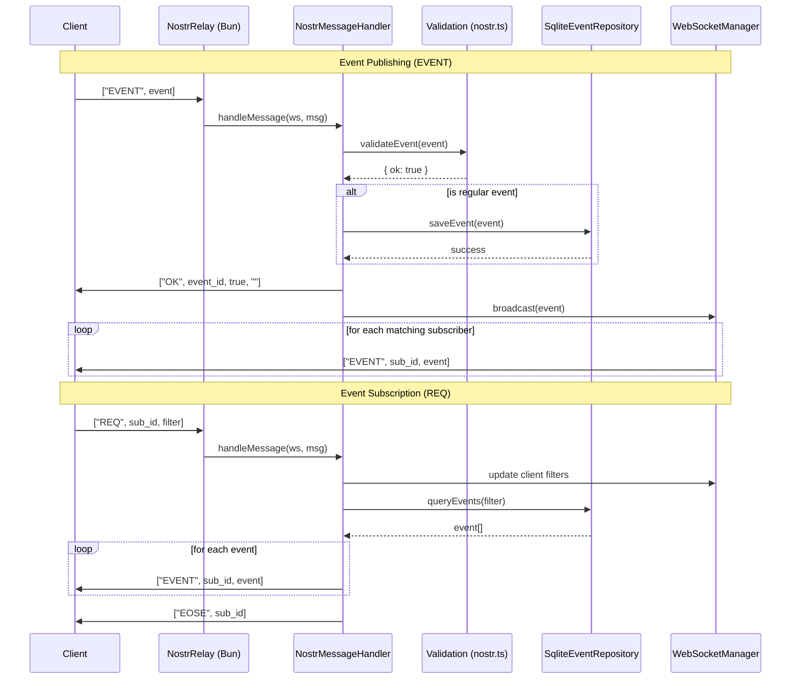

# n0str

**n0str** is a simple, reliable, and extensively tested [Nostr](https://github.com/nostr-protocol/nostr) relay implementation built on modern web technologies. Designed for simplicity and correctness, it leverages the power of **Bun**.


## Features

- **Simplicity**: Codebase designed to be easy to understand and maintain.
- **Extensively Tested**: comprehensive test suite ensuring high coverage and NIP compliance.
- **Efficient Storage**: Uses **SQLite** for reliable database interactions.
- **Full-Text Search**: Native support for NIP-50 search capability using SQLite FTS5.
- **Configurable**: Easy configuration via `n0str.json`.
- **Secure**: Implements NIP-13 (PoW), NIP-22 (Event Limits), and NIP-42 (Authentication).
- **Type-Safe**: Fully typed with TypeScript.

## Tested NIPs

n0str is tested against a wide range of Nostr Implementation Possibilities (NIPs):

| NIP | Description | Status |
| :--- | :--- | :--- |
| **01** | Basic Protocol Flow (EVENT, REQ, CLOSE) | Yes |
| **02** | Contact List and Petnames | Yes |
| **03** | OpenTimestamps Attestations | Yes |
| **05** | Mapping Nostr keys to DNS-based internet identifiers | Yes |
| **09** | Event Deletion | Yes |
| **10** | On "e" and "p" tags in Text Events | Yes |
| **11** | Relay Information Document | Yes |
| **12** | Generic Tag Queries | Yes |
| **13** | Proof of Work | Yes |
| **15** | Nostr Marketplace | Yes |
| **16** | Event Treatment | Yes |
| **17** | Private Direct Messages | Yes |
| **18** | Reposts | Yes |
| **20** | Command Results | Yes |
| **22** | Event `created_at` Limits | Yes |
| **23** | Long-form Content | Yes |
| **25** | Reactions | Yes |
| **28** | Public Chat | Yes |
| **33** | Parameterized Replaceable Events | Yes |
| **40** | Expiration Timestamp | Yes |
| **42** | Authentication of Clients to Relays | Yes |
| **44** | Encrypted Payloads (Versioned) | Yes |
| **45** | Counting results | Yes |
| **50** | Search Capability | Yes |
| **51** | Lists | Yes |
| **57** | Lightning Zaps | Yes |
| **65** | Relay List Metadata | Yes |
| **70** | Protected Events | Yes |
| **77** | Negentropy Syncing | Yes |
| **78** | Application-specific Data | Yes |

## Getting Started

### Quick Start with Nightly Binary

You can download the latest pre-compiled binary from the [Releases](https://github.com/tani/n0str/releases/tag/nightly) page.

**Linux / macOS:**

```bash
# Download the binary for your platform (e.g., linux-x64)
chmod +x n0str-linux-x64
./n0str-linux-x64
```

**Windows:**

Download `n0str-win-x64.exe` and run it from the terminal.

```powershell
.\n0str-win-x64.exe
```

### Prerequisites

- [Bun](https://bun.sh/) (v1.3.5 or later)

### Installation from Source

1. Clone the repository:

   ```bash
   git clone https://github.com/tani/n0str.git
   cd n0str
   ```

2. Install dependencies:

   ```bash
   bun install
   ```

### Running the Relay

Start the relay server:

```bash
bun start
```

The relay will start listening on `ws://localhost:3000` (or the port defined in your configuration).

## Configuration

n0str is configured via a `n0str.json` file in the root directory. If this file does not exist, default values will be used.

**Example `n0str.json`:**

```json
{
  "name": "My Custom Relay",
  "description": "My personal Nostr relay",
  "pubkey": "your-hex-pubkey-here",
  "contact": "admin@example.com",
  "limitation": {
    "max_message_length": 65536,
    "max_subscriptions": 20,
    "auth_required": false
  }
}
```

See the default configuration in `src/config.ts` for all available options.

### Environment Variables

You can also configure the relay using environment variables:

- `PORT`: The port to listen on (default: 3000).
- `LOG_LEVEL`: The logging level (default: info). Available levels: `trace`, `debug`, `info`, `warn`, `error`.
- `DATABASE_PATH`: The path to the SQLite database (default: `./n0str.db`).

## Architecture & Flow

n0str leverages a modular design where each component has a specific responsibility in the message lifecycle.

### Internal Message Lifecycle



### Component Roles

- **NostrRelay (src/relay.ts)**: Entry point using Bun's native WebSocket. Manages connection lifecycle and NIP-11 requests.
- **NostrMessageHandler (src/message.ts)**: Orchestrates message processing, validation, and storage logic.
- **SqliteEventRepository (src/sqlite.ts)**: Handles persistence and indexing using SQLite FTS5 for search.
- **WebSocketManager (src/websocket.ts)**: Tracks active connections and handles efficient event broadcasting.
- **Validation (src/nostr.ts)**: Verifies signatures, PoW, and protocol compliance.

## License

AGPLv3. See [LICENSE](LICENSE) for details.
